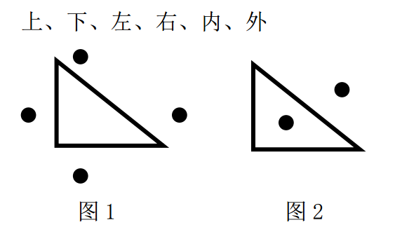
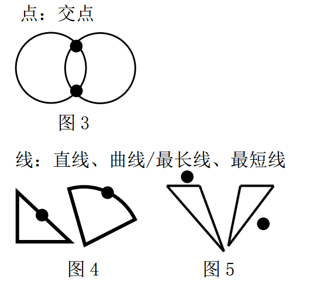
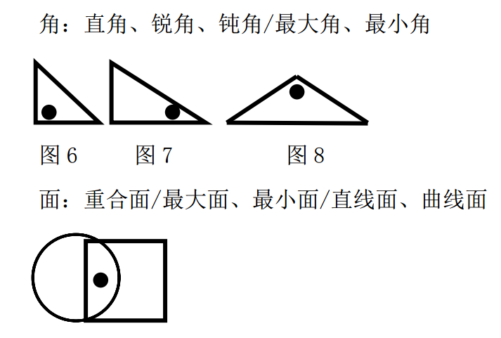
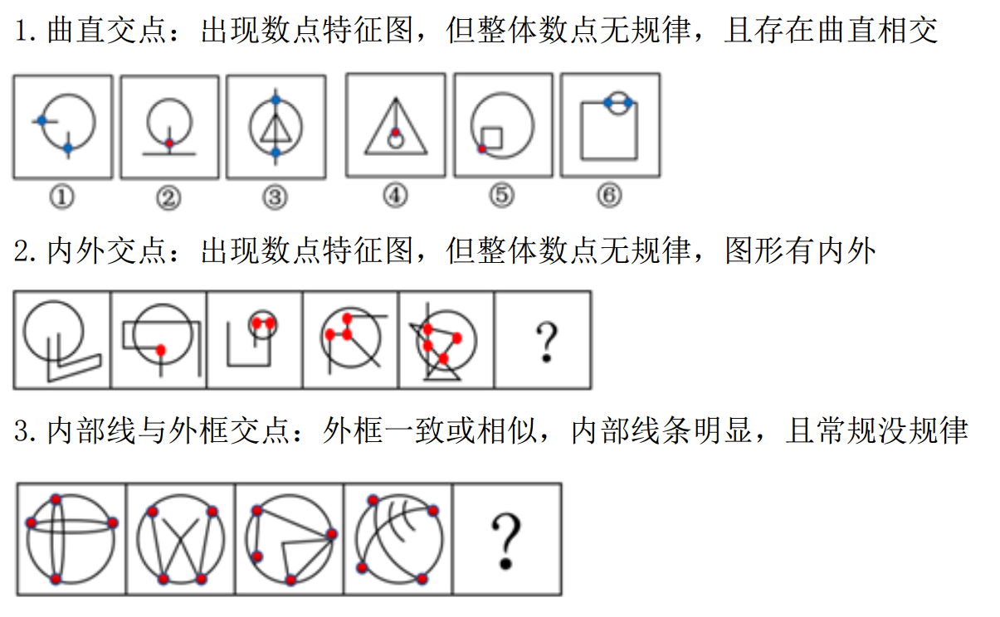

## 图形推理

### 位置规律

特点：元素组成相同

思路

平移

- 方向：上下左右、顺逆时针、斜对角

  运动轨迹：重合、循环从头开始、折返

  步数：恒定、递增递减

- 旋转

- 翻转

### 样式规律

- 加减同异：找缺口
- 黑白运算：图形轮廓相同，黑白块数量不同

### 属性规律

特征：元素组成不同、不相似

- 对称轴：方向、数量、对称轴是否和图形重合
- 曲直：全曲、全直、曲+直、内直外曲、外直内曲、左直右曲、右直左曲
- 开闭 

### 特殊规律

-  标记位置
  

- 标记图形

  点：交点

  线：最长线、最短线、直线、曲线

  角：最大角、最小角、直角、锐角、钝角

  面：重合面、最大面、最小面、直线面、曲线面

  

  

### 数量规律

元素组成不相同，属性没规律

- 点数量

  

- 线数量：直线数、曲线数

  

  特殊考点------笔画问题

  一笔画：线条连通且奇点数等于0或2

  多笔画：笔画数=奇点数 / 2

- 面数量：窟窿大，有留白
  面的形状、最大面形状、属性【对称、曲直】  

  

- 素数量：元素种类和个数、部分数

