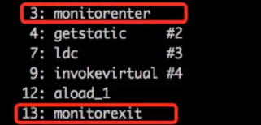
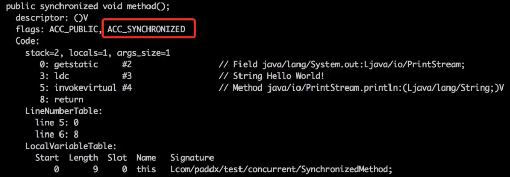
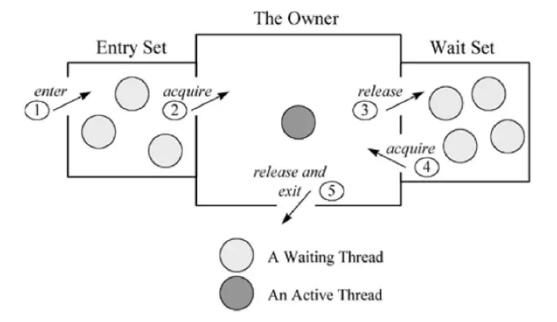
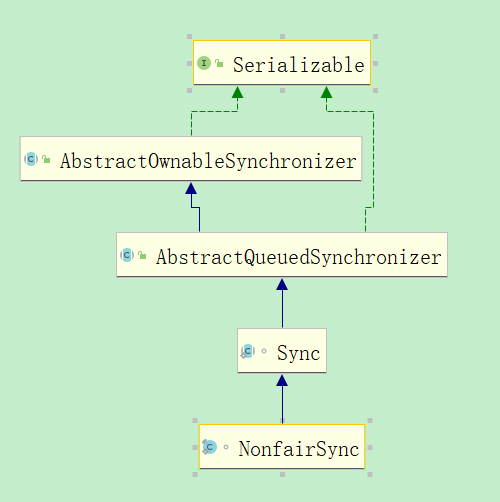
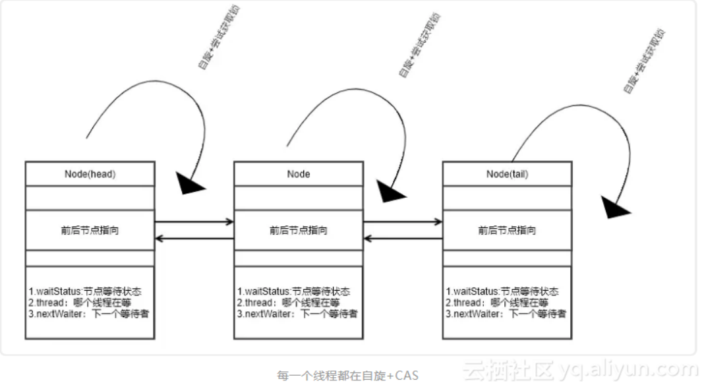
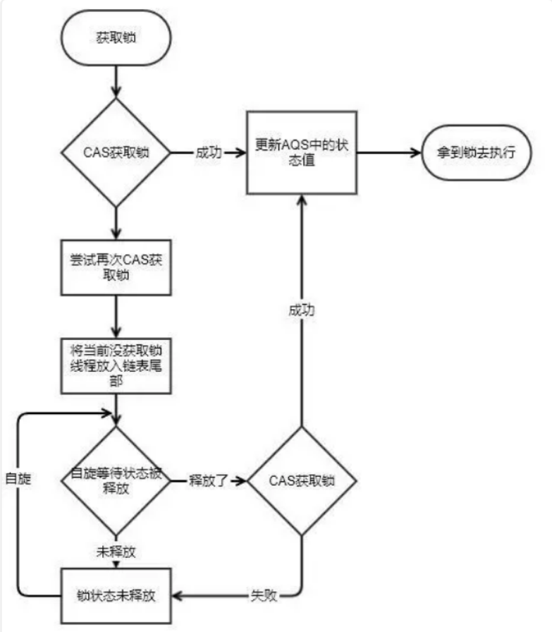
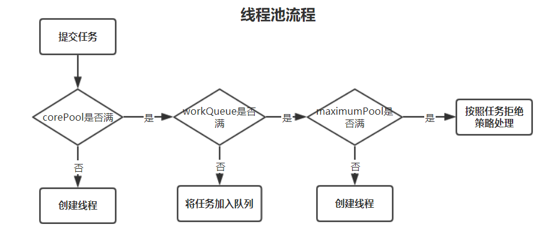

# 基础

### 实现多线程的方式

**一、继承Thread类**

1. 继承Thread类，重写run方法
2. 创建子类实例
3. 调用对象的start()

jdk1.8新增了lambda表达式，可以简化为new Thread(()->{  }).start()

**二、通过Runnable接口创建**

1. 定义Runnable接口的实现类，并重写run()
2. 创建实例，作为参数传入Thread实例
3. 调用Thread对象start()

**三、通过Callable接口创建**

- 实现Callable接口的call()方法，并且带有返回值
- 创建实现类的实例，使用FutureTask包装对象
- 将FutureTask对象传入Thread创建新线程并启动

```java
public class CallableThread implements Callable<String> {

    @Override
    public String call() throws Exception {
        return "hello";
    }

    public static void main(String[] args) throws Exception{
        Callable<String> callable = new CallableThread();
        FutureTask<String> stringFutureTask = new FutureTask<>(callable);
        Thread thread = new Thread(stringFutureTask);
        thread.start();
        System.out.println(stringFutureTask.get());
    }
}
```

**四、通过线程池**

利用Executors创建线程池

**扩展：Runnable和Callable的区别**

1. Callable定义的方法是call，Runnable定义的方法是run
2. call可以有返回值，run没有
3. call可以抛出异常，run不可以

### 进程和线程

进程是资源分配的基本单位，一个程序至少有一个进程，一个进程至少有一个线程

进程拥有独立的内存资源，而多个线程共享内存资源

线程是最小的执行单元

#### 进程通信

- 匿名管道：半双工，只能用于父子进程或兄弟进程之间
- 有名管道：
- 信号：
- 信号量：
- 消息队列
- 共享内存
- 套接字

### 并行和并发

并行：多个进程互不抢占CPU资源，可以同时进行；一个时间点，多个事件同时发生

并发：多个线程抢占CPU资源；一个时间段，多个事件同时发生

### 几个中断方法

**interrupt()**

给被调用线程设置中断标志，不会中断正在运行中的线程，实际上是在线程调用sleep、wait、join阻塞时抛出一个中断，使线程提早结束阻塞状态

**interrupted()**

static类型，检测并清除**当前线程**的中断状态，重点是当前线程，就是调用这个方法的线程，比如在main中调用thread1.interrupted()，得到main的中断状态

**isInterrupted()**

检测被调用线程的中断状态

**Thread.yield()**

让出CPU，进入就绪状态，让自己或其他和自己拥有线程运行，有可能还是自己

### 线程的状态转换


- 新建
  通过new创建的一个线程处于新建状态
- 就绪
  其他线程调用它的start()方法，该线程进入就绪状态
- 运行
  线程调度器从可运行线程池中选择一个线程作为当前线程
- 阻塞
  线程放弃占用cpu，暂停运行，分为三种阻塞：
  1. 等待阻塞：调用wait()，进入等待队列
  2. 同步阻塞：如果需要的同步锁被占用，进入锁池
  3. 其他阻塞：调用sleep()、join()
- 终止
  run()执行完毕或者异常退出

1. sleep、notify不会释放锁，wait会释放锁，尽量不要用这两个方法，可以使用CountDownLatch代替。使用await()等待门闩打开继续执行代码，countDown()减1。

2. synchronized锁住的对象是在堆内存中

3. 不要使用字符串常量作为锁对象

4. sleep()使线程进入睡眠状态，但是不会释放锁

5. wait()、notify()、notifyAll()都是定义在Object类中，因为这三个方法都定义在同步代码块中，这些方法的调用都依赖锁对象，而锁对象可以是任意对象，那么能被任意对象调用的方法一定是定义在Object中

6. t.join()阻塞调用此方法的线程，直到线程t完成

   主线程调用thread1.join()，会使主线程阻塞，而不是thread1线程

   ```java
   public class JoinTester01 implements Runnable {
    
       public void run() {
           System.out.printf(new Date());
       }
    
       public static void main(String[] args) {
           Thread thread1 = new Thread(new JoinTester01());
           Thread thread2 = new Thread(new JoinTester01());
   
           try {
               thread1.start();
               thread1.join();
               thread2.start();
               thread2.join();
           } catch (InterruptedException e) {
               // TODO Auto-generated catch block
               e.printStackTrace();
           }
   
           System.out.println("Main thread is finished");
       }
   }
   ```

### ThreadLocal

http://www.jasongj.com/java/threadlocal/

线程本地变量，适用于每个线程需要自己独立的实例且该实例在多个方法中被使用

ThreadLocal有一个静态内部类ThreadLocalMap，是一个Entry数组，Entry继承WeakReference，key是ThreadLocal实例，每个线程都有一个ThreadLocalMap。通过key.threadLocalHashCode&(capacity-1)进行定位

```java
static class Entry extends WeakReference<ThreadLocal<?>> {
    /** The value associated with this ThreadLocal. */
    Object value;

    Entry(ThreadLocal<?> k, Object v) {
        super(k);
        value = v;
    }
}
```

#### 内存泄露

同时满足两个条件就会发生内存泄露

1. 触发了垃圾回收或者ThreadLocal引用被置为null，且后面没有set、get、remove操作
2. 线程一直运行，不停止


Entry中的key是一个弱引用（虚线），如果ThreadLocal Ref的强引用没了，那么就会被回收，key变为null，之后如果没有set、get、remove操作（都会调用expungeStaleEntry将value设为null），value就发生内存泄露

使用时遵循两个原则即可：

1. ThreadLocal声明为private static final
2. 使用后调用remove

#### 应用场景

1. 数据库事务。通过AOP拦截操作数据库事务的函数，进入函数前获取Connection存储在ThreadLocal中，使用时从ThreadLocal中读取

### InheritableThreadLocal

可以实现多个线程共享ThreadLocal的值

```java
public class InheritableThreadLocal<T> extends ThreadLocal<T>
```

如果当前线程(main)的inheritableThreadLocals变量不为null，那么就把main线程的inheritableThreadLocals赋给创建的新线程

```java
public class Thread implements Runnable {
	Thread parent = currentThread();
	if (parent.inheritableThreadLocals != null)
    	this.inheritableThreadLocals =
        	ThreadLocal.createInheritedMap(parent.inheritableThreadLocals);
}	
```

```java
public static void main(String[] args) {
    ThreadLocal<String> threadLocal = new InheritableThreadLocal<>();
    threadLocal.set("hello");
    Thread t = new Thread(() -> System.out.println(threadLocal.get()));
    t.start();
}
```

### 死锁

**概念**

多个线程因为争夺资源而互相等待

**四个必要条件**

1. 互斥条件：一段时间内一个资源只能被一个线程使用
2. 请求与保持条件：线程请求资源被阻塞时，不会释放已经获得的资源
3. 不可剥夺条件：线程在未使用完获得的资源之前，不能被其他线程强行夺走
4. 循环等待条件：若干线程间形成首尾相接互相等待的关系

**预防死锁**

- 破坏请求与保持条件：一次性申请所有资源
- 破坏不可抢占条件：当一个线程获得某种不可抢占资源，提出新的资源申请，如果不能满足，就释放所有的资源
- 破坏循环等待条件：顺序申请资源

**解除死锁**

1. 抢占资源：从若干线程中抢占足够多的资源分配给死锁线程
2. 终止线程：将若干个死锁线程终止

### sleep()和yield()

1. sleep不考虑其他线程的优先级，而yield只给同等及以上优先级的线程运行的机会
2. 线程执行sleep后进入阻塞状态，而yield会变成就绪，和其他线程一起竞争

### 多线程同步方法


# 线程安全性

## 原子性

###  竞态条件

当某个计算的正确性取决于多个线程的交替执行顺序时，就会发生竞态条件

最常见的就是“先检查后执行”和“读取-修改-写入”三连

## synchronized

https://www.jianshu.com/p/e62fa839aa41

由JVM实现的同步锁，JUC.Lock依赖CPU指令

**访问同步代码块**



monitorenter：当monitor被占用时就会处于锁定状态，线程执行monitorenter指令时会尝试获取monitor所有权，过程如下

<blockquote>
如果monitor的进入数为0，则该线程进入monitor，然后将进入数设为1</br>
如果线程已经占用该monitor，只是重新进入，那么就把进入数+1</br>
如果其他线程占用了该monitor，则线程进入阻塞状态，直到monitor的进入数为0，再尝试重新获取monitor的所有权
</blockquote>


monitorexit：指令执行时，monitor的进入数减1，当值为0时，线程退出monitor

两个指令的执行是通过调用操作系统的互斥原语**mutex**实现的，被阻塞的线程会被挂起，等待重新调用，会导致用户态和内核态的来回切换，影响性能

**同步方法**



当方法调用时，会先检查方法的ACC_SYNCHRONIZED标志是否被设置，如果是，线程先获取monitor，成功则执行方法，执行完之后释放

**原理**

每个对象都关联一个监视器锁(Monitor)，Monitor依赖操作系统的Mutex Lock实现。MarkWord锁标志位为10时，指针指向Monitor对象

JVM中，Monitor是由ObjectMonitor实现的，当多个线程同时访问同步代码块时：

- 首先进入EntryList，当线程获取到monitor后，进入Owner区域并把owner变量设为当前线程，同时count+1
- 如果线程调用wait()，将释放持有的monitor，owner变为null，count-1，同时进入WaitList集合等待被唤醒
- 如果线程执行完毕，也会释放持有的monitor，count-1



**java对象头**

synchronized的锁存在对象头中。对象头占用两个字宽，如果对象是数组，占用三个字宽。32位虚拟机中，一个字宽是4个字节，32bit；64位虚拟机中，一个字宽是8个字节，也就是64bit

Class Metadata Address指向对象所属类的地址


​																	 Mark Word存储结构

**重入**

内置锁是可以重入的：线程能够获得一个已经由它自己持有的锁

m1=m2：在方法名上加**synchronized**等于在方法体上加**synchronized(this)**

m3=m4：在方法名上加**synchronized static**等于在方法体上加**synchronized (类名.class)** 

```java
public class C001 {
    private static int count = 10;

    public synchronized void m1() {
        count--;
        System.out.println(Thread.currentThread().getName() + "count = " + count);
    }

    public void m2() {
        synchronized (this) {
            count--;
            System.out.println(Thread.currentThread().getName() + "count = " + count);
        }
    }
    
    public synchronized static void m3() {
        count--;
        System.out.println(Thread.currentThread().getName() + "count = " + count);
    }

    public void m4() {
        synchronized (C001.class) {
            count--;
            System.out.println(Thread.currentThread().getName() + "count = " + count);
        }
    }
    
}
```

## 锁优化

<font color="red">非常好的锁转化图https://upload-images.jianshu.io/upload_images/4491294-e3bcefb2bacea224.png</font>

**自旋锁**

让线程执行忙循环（自旋）。虽然避免了线程切换的开销，但是要占用处理器时间，所以占用时间短，效果非常好，反之只会白白浪费cpu资源。适用于锁保护的临界区很小的情况，超过一定次数就应该被挂起。-XX:+UseSpinning开启，可以使用-XX:PreBlockSpin更改次数，默认为10

**自适应自旋锁**

自旋的时间不固定，由前一次在同一个锁上的自旋时间和锁的拥有者的状态决定

**锁清除**

虚拟机JIT编译器在运行时，对一些代码上要求同步，但是被检测到不可能存在共享数据竞争的锁进行清除

**锁粗化**

JVM检测到有一系列的对同一个对象加锁的操作，那么会把加锁同步的范围扩展到整个操作序列的外部

**轻量级锁**

对于轻量级锁，其性能提升的依据是 **“对于绝大部分的锁，在整个生命周期内都是不会存在竞争的”**，如果打破这个依据则除了互斥的开销外，还有额外的CAS操作，**因此在有多线程竞争的情况下，轻量级锁比重量级锁更慢**。

目的是在没有多线程竞争的前提下，减少传统的重量级锁因使用操作系统互斥量而产生的性能消耗。轻量级锁的过程：

1. 在线程进入同步块时，如果此同步对象没有被锁定，则虚拟机先在当前线程的栈帧中建立**锁记录**(Lock Record)，用于存储锁对象Mark Word的拷贝，官方称为Displaced Mark Word。
2. 虚拟机使用CAS操作尝试将Mark Word中锁记录指针指向当前锁记录。如果成功，那么这个线程就拥有了该对象的锁，并且对象的Mark Word的锁标志位变为"00"，同时Lock Record里的owner指向对象的Mark Word
3. 如果失败了，虚拟机首先会检查对象Mark Word是否已经指向当前线程的栈帧，如果是就说明当前线程已经拥有了这个对象的锁，直接进入同步块执行，否则说明这个锁对象已经被抢占了，进入自旋执行第2步，如果还是失败，轻量级锁就要膨胀为重量级锁，锁标志的状态值变为"10"，Mark Word中存储的就是指向重量级锁的指针，后面等待锁的线程也要进入阻塞状态

轻量级锁的释放也是通过CAS来完成：

1. 通过CAS操作尝试把对象当前的Mark Word替换回Displaced Mark Word，如果成功，整个同步过程就完成了
2. 如果失败，说明有其他线程尝试获取锁，那么在释放锁的同时要唤醒被挂起的线程


**偏向锁**

目的是消除数据在无竞争情况下的同步原语，是在单线程执行代码块时使用的机制，进一步提升单线程执行代码块的性能。在多线程并发的情况下一定会转为轻量级锁或重量级锁。JDK6默认开启，-XX:-UseBiasedLocking。

右下角：如果未退出同步代码块，则升级为轻量级锁


1. 检查Mark Word是否为可偏向状态，即锁标志位"01"，偏向锁标志位"1"
2. 如果是，就判断Mark Word中的thread ID是否是当前线程，如果是，就执行同步块；如果不是当前线程或者偏向锁标志位为"0"，就尝试通过CAS操作将当前线程ID记录到Mark Word的thread ID中，如果成功，就执行同步块
3. 如果失败，证明存在多线程竞争，撤销偏向锁，当到达全局安全点，获得偏向锁的线程被挂起，如果持有锁的线程处于未活动状态或者已经退出同步块，则恢复到无锁状态，以允许其他线程竞争，并唤醒持有锁的线程，否则升级为轻量级锁，


## CAS

CAS在硬件层面保证原子性，不会锁住当前线程，因此效率很高

包括三个操作数：内存地址、预期值、新值。当内存地址的数值等于预期值时，将其替换成新值。Java的CAS是通过调用C++实现的，核心就是一条带lock前缀的 cmpxchg 指令

**问题**

1. **ABA问题**。如果一个值原来是A，变成B，又变成A，那么CAS检查时会认为这个值没有变化，操作成功。
   解决方法是在变量前面追加版本号，A-B-A就变成了1A-2B-3A。在Java中，AtomicStampedReference和AtomicMarkableReference支持在两个变量上执行原子的条件更新。
2. 循环时间长开销大。自旋CAS如果长时间不成功，会给CPU带来非常大的执行开销。不适合竞争十分频繁的场景
3. 只能保证一个共享变量的原子操作，JDK1.5提供了AtomicReference类来保证引用对象之间的原子性，可以把多个变量放在一个对象进行CAS操作

# 基础构建模块

## 并发容器

### ConcurrentHashMap

详见Java面试题总结部分

JDK1.7使用粒度更细的加锁机制**分段锁**

JDK1.8抛弃了分段锁，采用了**CAS+synchronized**来保证并发安全

不需要在迭代过程中对容器加锁，返回的迭代器具有弱一致性

### CopyOnWriteArrayList

用于替代同步List，在迭代期间不需要对容器进行加锁或复制。

容器的线程安全性在于，只要正确发布一个事实不可变的对象，那么在访问该对象时就不再需要进一步的同步。在每次**修改**时，都会创建并重新发布一个新的容器副本，从而实现可变性。容器的迭代器保留一个指向底层基础数组的引用，不会被修改。

每次修改容器时都会复制底层数组。因此仅当迭代操作远多于修改操作时才使用。

### ConcurrentLinkedQueue

非阻塞队列，通过CAS实现

## 阻塞队列

### BlockingQueue接口

原理是使用ReentrantLock进行阻塞

put：加入队列尾部，满了阻塞

offer：加入队列尾部，不阻塞，满了不会报错

add：加入队列尾部，不阻塞，满了会报错

poll：取出队列首位并且删除，不阻塞

take：取出队列首位并且删除，阻塞

锁没有分离

### ArrayBlockingQueue

有界阻塞队列，只能在初始化时设置容量，分为公平和非公平访问队列

### LinkedBlockingQueue

链表形式，可以是有界和无界

### PriorityBlockingQueue

优先级无界阻塞队列，元素必须实现Comparable接口或者传入Comparator比较器

### SynchronousQueue

只能容纳单个元素，加入和取出都是阻塞方法

### DelayQueue

到达指定的时间才能获取元素，元素需要实现Delayed接口，Delayed接口继承了Comparable接口，所以需要实现getDelay和compareTo

## Lock

### ReentrantLock

1. 可以替代synchronized
2. synchronized会自动释放锁，Lock不会，必须要手动释放，放在finally里释放
3. 可以通过tryLock进行尝试锁定，同时可以指定时间
4. 如果使用lockInterruptibly()，可以打断等待锁的线程
5. 可以指定为公平锁
6. 可以绑定多个condition

### AQS

https://blog.csdn.net/fuyuwei2015/article/details/83719444

https://www.cnblogs.com/waterystone/p/4920797.html

```java
public ReentrantLock() {
    sync = new NonfairSync();
}
```

一步步往上找



主要代码都在AQS中，AQS通过双向链表和状态值(volatile)实现锁的

lock()通过CAS修改状态值，成功则获取到锁，将当前线程设为锁拥有者；如果失败了，调用acquire，主要有三步

```java
//非公平锁
static final class NonfairSync extends Sync {
    /**
     * Performs lock.  Try immediate barge, backing up to normal
     * acquire on failure.
     */
    final void lock() {
        //公平锁没有这一步
        if (compareAndSetState(0, 1))
            setExclusiveOwnerThread(Thread.currentThread());
        else
            acquire(1);
    }
}
//AQS
public abstract class AbstractQueuedSynchronizer{
    public final void acquire(int arg) {
        if (!tryAcquire(arg) &&
            acquireQueued(addWaiter(Node.EXCLUSIVE), arg))
            selfInterrupt();
	}
}

```

概括一下acquire的流程：

1. 通过tryAcquire()尝试直接获取资源，如果成功直接返回
2. 如果失败，addWaiter()将线程加入等待队列的尾部
3. acquiredQueued()将线程挂起，被唤醒后尝试获取资源

第一步。tryAcquire尝试再次通过CAS获取锁(NonfairSync里重写了这个方法，具体在下文)。检查state字段，若为0，表示锁未被占用，那么尝试占用，若不为0，检查当前锁是否被自己占用，若被自己占用，则更新state字段，表示重入锁的次数。如果以上两点都没有成功，则获取锁失败，返回false。

```java
static final class NonfairSync extends Sync {
    protected final boolean tryAcquire(int acquires) {
        //Sync的方法
        return nonfairTryAcquire(acquires);
 	}
}

abstract static class Sync extends AbstractQueuedSynchronizer {
    final boolean nonfairTryAcquire(int acquires) {
        final Thread current = Thread.currentThread();
        //获取状态
        int c = getState();
        //如果锁是可用的
        if (c == 0) {
            //CAS尝试获取
            if (compareAndSetState(0, acquires)) {
                setExclusiveOwnerThread(current);
                return true;
            }
        }
        //判断当前线程是否为锁拥有者 这是支持可重入的实现
        else if (current == getExclusiveOwnerThread()) {
            int nextc = c + acquires;
            if (nextc < 0) // overflow
                throw new Error("Maximum lock count exceeded");
            setState(nextc);
            return true;
        }
        return false;
    }
}
```

第二步，入队。addWaiter将当前线程加入双向链表中

```java
/**
 * 将新节点和当前线程关联并且入队列
 * @param mode 独占/共享
 * @return 新节点
 */
private Node addWaiter(Node mode) {
    //初始化节点,设置关联线程和模式(独占 or 共享)
    Node node = new Node(Thread.currentThread(), mode);
    // 获取尾节点引用
    Node pred = tail;
    // 尾节点不为空,说明队列已经初始化过
    if (pred != null) {
        node.prev = pred;
        // 设置新节点为尾节点
        if (compareAndSetTail(pred, node)) {
            pred.next = node;
            return node;
        }
    }
    // 上一步失败则通过enq入队
    enq(node);
    return node;
}

```

最开始队列为空（head和tail为空），enq()建立头节点，如第一个框，然后将当前线程节点加入队列


第三步。acquireQueued通过自旋，判断当前队列节点是否可以获取锁，如果不能，则调用`shouldParkAfterFailedAcquire`判断是否可以挂起。判断**前一个节点**的状态：如果状态=Node.SIGNAL，表明线程已经准备被阻塞，返回true，调用parkAndCheckInterrupt将自己挂起；如果状态>0，说明节点已经取消了获取锁的操作， 那么就递归删除节点；否则就将状态设为Node.SIGNAL。

```java
final boolean acquireQueued(final Node node, int arg) {
    boolean failed = true;
    try {
        boolean interrupted = false;
        for (;;) {
            final Node p = node.predecessor();
            //如果前驱是head,即该结点已成老二，那么便有资格去尝试获取锁
            if (p == head && tryAcquire(arg)) {
                setHead(node);
                p.next = null; // help GC
                failed = false;
                return interrupted;
            }
            // 判断获取失败后是否可以挂起,若可以则挂起
            if (shouldParkAfterFailedAcquire(p, node) &&
                parkAndCheckInterrupt())
                interrupted = true;
        }
    } finally {
        if (failed)
            cancelAcquire(node);
    }
}

/**
 * 判断当前线程获取锁失败之后是否可以挂起.
 */
private static boolean shouldParkAfterFailedAcquire(Node pred, Node node) {
    //前驱节点的状态
    int ws = pred.waitStatus;
    if (ws == Node.SIGNAL)
        // 前驱节点状态为signal,返回true
        return true;
    // 前驱节点状态为CANCELLED
    if (ws > 0) {
        // 从队尾向前寻找第一个状态不为CANCELLED的节点
        do {
            node.prev = pred = pred.prev;
        } while (pred.waitStatus > 0);
        pred.next = node;
    } else {
        // 将前驱节点的状态设置为SIGNAL
        compareAndSetWaitStatus(pred, ws, Node.SIGNAL);
    }
    return false;
}
  
/**
 * 挂起当前线程,返回线程中断状态并重置
 */
private final boolean parkAndCheckInterrupt() {
    LockSupport.park(this);//进入waiting状态 等待unpark()或interrupt()唤醒
    return Thread.interrupted();//被唤醒后，查看是否被中断
}
```







#### Condition

AQS有一个内部类ConditionObject实现了Condition，它维护了自己的等待队列，调用await()将线程加入等待队列， signal()将等待队列移动到同步队列进行锁竞争

### Semaphore 

控制同时访问的线程个数，底层AQS，相当于共享锁

acquire()：获取一个许可

release()：释放许可

### CountDownLatch

一个线程等其他线程。

静态内部类Sync继承AQS，设定一个初始值，countDown()释放共享锁，如果释放完之后为0，唤醒等待线程，await()获取共享锁的状态，如果不为0就将线程添加到队列中，自旋两次阻塞，await会一直阻塞直到计数器为0，或者等待中的线程中断，或者等待超时。

### CyclicBarrier

类似于闭锁，关键区别在于所有线程必须同时到达栅栏位置，才能继续执行。只用await()方法即可

内部有一个ReentrantLock和一个Condition，await()将当前线程加入Condition的条件队列，释放锁然后调用LockSupport.park()阻塞当前线程

**CountDownLatch和CyclicBarrier的比较**

1. CountDownLatch是一个线程等待等待其他线程，即等待其他线程完成事件之后再执行；而CyclicBarrier是线程互相等待，即等待所有线程完成事件之后再执行
2. CountDownLatch不可以重用，而CyclicBarrier可以
3. CountDownLatch有两个方法countDown()和await()；CyclicBarrier只有await()

### ReentrantReadWriteLock

有两把锁，一个读锁，一个写锁，实现是Sync，继承AQS

```java
/** Inner class providing readlock */
private final ReentrantReadWriteLock.ReadLock readerLock;
/** Inner class providing writelock */
private final ReentrantReadWriteLock.WriteLock writerLock;
```

AQS中volatile类型的状态被分为两部分，高16位表示读锁个数，低16位表示写锁个数


加写锁逻辑


```java
protected final boolean tryAcquire(int acquires) {
    Thread current = Thread.currentThread();
    int c = getState();
    int w = exclusiveCount(c);
    //锁个数不为0
    if (c != 0) {
        // 写锁为0(说明有读锁)或者写锁不为0且当前线程不是写锁拥有者，返回false
        if (w == 0 || current != getExclusiveOwnerThread())
            return false;
        //写锁数量大于65535，抛出异常
        if (w + exclusiveCount(acquires) > MAX_COUNT)
            throw new Error("Maximum lock count exceeded");
        // Reentrant acquire
        setState(c + acquires);
        return true;
    }
    //锁个数为0
    //判断当前线程节点是否可以获取锁
    //writerShouldBlock：非公平锁直接返回false，公平锁要判断是否处于队列头部
    //如果可以，则通过CAS写入
    if (writerShouldBlock() || !compareAndSetState(c, c + acquires))
        return false;
    //CAS成功则设置当前线程为拥有者
    setExclusiveOwnerThread(current);
    return true;
}
```

加读锁逻辑：

如果有其他线程占有写锁，则失败，否则通过CAS增加读状态，状态值+(1<<<16)

```java
protected final int tryAcquireShared(int unused) {
    Thread current = Thread.currentThread();
    int c = getState();
    //写锁不为0且不是当前线程占有
    if (exclusiveCount(c) != 0 &&
        getExclusiveOwnerThread() != current)
        return -1;
    int r = sharedCount(c);
    if (!readerShouldBlock() &&
        r < MAX_COUNT &&
        compareAndSetState(c, c + SHARED_UNIT)) {
        if (r == 0) {
            firstReader = current;
            firstReaderHoldCount = 1;
        } else if (firstReader == current) {
            firstReaderHoldCount++;
        } else {
            HoldCounter rh = cachedHoldCounter;
            if (rh == null || rh.tid != getThreadId(current))
                cachedHoldCounter = rh = readHolds.get();
            else if (rh.count == 0)
                readHolds.set(rh);
            rh.count++;
        }
        return 1;
    }
    return fullTryAcquireShared(current);
}
```

# 线程池

1. 降低资源消耗：重复利用已有线程降低线程创建、销毁的消耗
2. 提高响应速度：任务到达时不需要等待线程创建即可执行
3. 提高线程的可管理性

几个类的关系图


### execute()和submit()

execute没有返回值，submit会返回一个Future类型的对象，可以通过get()来获取返回值，该方法会阻塞线程直到任务完成

### ThreadPoolExecutor

**corePoolSize：**线程池中最少线程数

**maximumPoolSize：**最大线程数

**keepAliveTime**：当存活线程大于corePoolSize时，空闲线程能够存活的时间



### Executors

底层实现是ThreadPoolExecutor，Executors中的静态工厂方法：

- SingleThreadExecutor是一个单线程的Executor，keepAliveTime=0表示不回收
- FixedThreadPool创建一个固定大小线程池，keepAliveTime=0
- CachedThreadPool创建一个可缓存的线程池，会根据处理请求动态调整大小，keepAliveTime=60，队列为SynchronousQueue  
- ScheduledThreadPool创建一个固定大小的线程池，以定时方式来执行任务

阿里的开发手册中强制不允许使用Executors创建线程池，原因如下：

1. newSingleThreadExecutor和newFixedThreadPool的任务队列长队是Integer.MAX_VALUE
2. newCachedThreadPool和newScheduledThreadPool的maximumPoolSize参数值是Integer.MAX_VALUE

可能会堆积大量的请求，从而导致OOM

### 线程饥饿死锁

在线程池中，如果任务依赖其他任务，那么可能产生死锁。例如在单线程的Executor中，如果一个任务将另一个任务提交到同一个Executor中，并且等待这个被提交任务的结果，那么就会引发死锁

下述程序中，main将RenderPageTask提交到了Executor中，而这个任务又将两个子任务提交到同一个Executor中并且等待执行的结果，所以2个子任务就会阻塞在线程池中，而RenderPageTask任务得不到返回也会一直阻塞，这就导致了线程饥饿死锁

```java
public class ThreadDeadLock {
    ExecutorService executor = Executors.newSingleThreadExecutor();

    public class RenderPageTask implements Callable<String> {
        @Override
        public String call() throws Exception {
            Future<String> header, footer;
            header = executor.submit(() -> {
                System.out.println("加载页眉");
                Thread.sleep(2 * 1000);
                return "header";
            });
            footer = executor.submit(() -> {
                System.out.println("加载页眉");
                Thread.sleep(2 * 1000);
                return "footer";
            });
            return header.get()+footer.get();
        }
    }

    public static void main(String[] args) throws ExecutionException, InterruptedException {
        ThreadDeadLock threadDeadLock = new ThreadDeadLock();
        Future<String> future = threadDeadLock.executor.submit(threadDeadLock.new RenderPageTask());
        System.out.println(future.get());
    }
}
```

### 饱和策略

1. Abort策略是默认的饱和策略，该策略将抛出未检查的RejectedExecutionException
2. Discard策略：新提交的任务被抛弃
3. DiscardOldest策略会抛弃下一个将被执行的任务，然后尝试重新提交新的任务
4. CallerRuns策略将某些任务回退到调用者

# Java内存模型

### 并发编程模型两个关键问题

1. 线程之间如何通信：共享内存和消息传递。在共享内存模型中，线程之间共享程序的公共状态，通过写-读内存中的公共状态进行**隐式**通信；在消息传递模型中，线程之间没有公共状态，线程之间必须通过发送消息**显式**进行通信。
2. 线程之间如何同步。同步是指程序中用于控制不同线程间**操作发生相对顺序**的机制。在共享内存模型中，同步是**显式**进行的，必须显式指定某个方法或某段代码需要在线程之间互斥执行。在消息传递模型中，由于消息的发送必须在消息的接收之前，因此同步是**隐式**的。

Java的并发采用的是共享内存模型，线程之间的通信是隐式进行的。

屏蔽各种硬件和操作系统的内存访问差异，定义程序中各个变量的访问规则，保证**并发**编程中的原子性、可见性和有序性

1. 原子性：
2. 可见性：当多个线程访问同一个变量时，如果一个线程修改了这个值，其他线程能够立即看到
3. 有序性：主要用于线程间的通讯

### 主内存和工作内存

JMM规定所有共享变量都存在主内存，每条线程有自己的工作内存，保存了线程使用到的变量的主内存副本拷贝，线程对变量的所有操作都必须在工作内存完成，volatile变量也不例外。

### 重排序

编译器和处理器常常会对指令做重排序

1. 编译器优化的重排序。编译器在不改变单线程程序语义的前提下，可以重新安排语句的执行顺序
2. 指令级并行的重排序。现代处理器采用了指令级并行技术（Instruction-Level Parallelism，ILP）来将多条指令重叠执行。如果不存在**数据依赖性**，处理器可以改变语句队形机器指令的执行顺序。
3. 内存系统的重排序。由于处理器使用缓存和读/写缓冲区，这使得**加载**和**存储操作**看上去可能是在乱序执行。

从Java源代码到最终实际执行的指令序列的过程：


### volatile

**可见性原理**

内存可见性是基于内存屏障实现的。

汇编代码中，volatile变量会多出一个lock前缀的指令，这个指令会：

1. 禁止指令重排序
2. 将当前cpu缓存行的数据写回到主存
3. 其他cpu通过缓存一致性协议发现自己缓存行对应的内存地址被修改，就会把缓存行设置为无效状态，重新从主存读取

**应用场景**

- 对变量的写不依赖当前值，或者能够确保只有单个线程更新变量的值
- 该变量不会与其他变量一起纳入不变性条件中

加锁可以保证可见性和原子性，volatile变量只能保证可见性。目前商用虚拟机几乎都把64位的long和double的读写操作作为原子操作来对待，所以一般不需要专门声明为volatile

**volatile的内存语义**

写的内存语义：JMM将线程对应的本地内存中的共享变量值写回主内存

读的内存语义：当读一个volatile变量时，JMM会将线程对应的本地内存设置为无效，从主内存中读取

为了实现volatile内存语义，编译器生成字节码时，会在指令队列中插入内存屏障来禁止特性类型的处理器重排序。


​																		volatile重排序规则表

编译器在生成字节码时，会在指令序列中插入内存屏障来禁止特定类型的处理器重排序

- 在volatile写操作的前面插入StoreStore屏障
- 在volatile写操作的后面插入StoreLoad屏障
- 在volatile读操作的后面插入LoadLoad、LoadStore屏障

### happens-before

JMM把happens-before要求禁止的重排序分为两类，采取了不同的策略：

- 会改变程序执行结果的重排序，JMM要求编译器和处理器必须禁止
- 不会改变程序执行结果的重排序，JMM对编译器和处理器不做要求

JSR-133对happens-before关系的定义如下：

1. 如果一个操作happens-before另一个操作，那么第一个操作的执行结果将对第二个操作可见，而且第一个操作的执行顺序排在第二个操作之前
2. 两个操作之间存在happens-before关系，并不意味着Java平台的具体实现必须要按照happens-before关系指定的顺序执行。如果重排序之后的执行结果，与按happens-before关系来执行的结果一致，那么重排序不违法

**happens-before规则**

1. 程序顺序规则：一个线程中内，前面的操作happens-before该线程的任意后续操作
2. 监视器锁规则：对于一个锁的解锁，happens-before随后对这个锁的加锁
3. volatile变量规则：对于一个volatile域的写，happens-before任意后续对这个volatile域的读
4. 传递性：如果A happens-before B，且B happens-before C，那么A happens-before C
5. 线程启动规则：Thread.start()方法happens-before线程中的每个操作
6. 线程终止规则：线程中的所有操作happens-before线程的终止操作
7. 线程中断规则：对线程interrupt()方法的调用先行发生于被中断线程中检测中断事件的代码
8. 对象终结规则：一个对象的初始化完成先行发生于finalize()的开始
