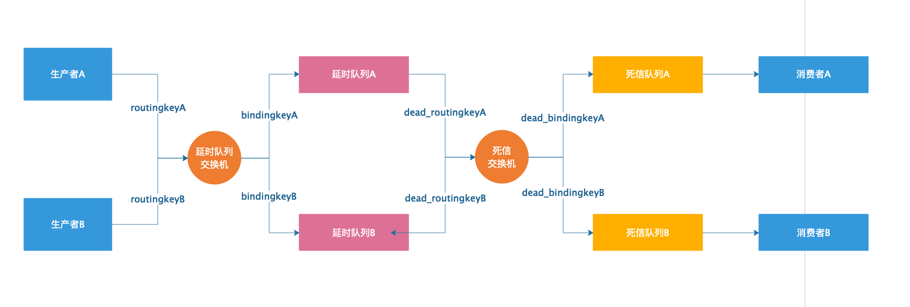

参考：https://blog.csdn.net/hellozpc/article/details/81436980


## 概念

采用AMQP队列协议的一种消息队列技术，实现了服务间的高度解耦

社区活跃，延迟微妙级，是最低的，消息可靠性高

### 好处

1. 具备异步、削峰、负载均衡的功能
2. 持久化
3. 实现了生产者和消费者的解耦
4. 在高并发场景下，将同步访问变为串行访问

### 缺点

1. 系统复杂度提高
2. 一致性问题

## AMQP

提供统一消息服务的应用层高级消息队列协议，是应用层协议的一个开放标准


- Broker：消息队列服务器实体，比如RabbiiMQ Server
- Virtual Host：每个用户有独立的vhost
- Connection：在publisher/consumer和broker之间的TCP连接

## 消息可靠性

消息在RabbitMQ中的经由之路：

1. 生产者将消息发送到交换机
2. 交换机根据路由规则转发到队列
3. 队列存储消息
4. 消费者消费订阅的队列

在每个阶段都要保证消息的可靠性

### 发送方确认机制

RabbitMQ提供了事务机制，但是是同步的，性能低，不采用

生产者开启confirm模式，每条消息有唯一的ID，消息被持久化之后，RabbitMQ回传一个confirm消息(交换机将消息转发至队列，队列将消息持久化之后，RabbitMQ才会发送confirm)，消息中的deliveryTag就是确认消息的序号，如果出现错误，就会发送nack信息。

问题：RabbitMQ持久化是异步操作，将多条消息一次性持久化，因此confirm机制会有延迟；如果收到nack，处理回调函数时出现异常或者生产者挂了，则会导致消息丢失

解决：

1. 先将消息放到redis，再放入队列
2. 如果收到confirm，就修改redis中的数据状态；如果收到nack，就删除失败的消息并放入失败的redis，由定时任务定期扫描并重新投递
3. 生产者redis定时任务扫描redis中存放一定时间，但是状态还是未投递的信息（投递没有得到反馈），扫描到之后将它们删除并放入失败的redis

### 交换机转发至队列

交换机在将消息转发至队列时，可能无法匹配到队列。

- 当mandatory为true时，如果交换机无法匹配到队列，就会调用Basic.return命令把消息返回给生产者；为false直接丢弃。
- 备份交换机：匹配不到队列时会将消息发送到备份交换机

### 队列和消息持久化

队列和消息都要设置持久化。RabbitMQ会先将消息缓存，然后批量持久化，如果这段时间宕机，消息就会丢失，采用Confirm可以避免。这样也无法避免出现单机故障，就需要引入镜像队列。

### 消息确认机制

- 自动确认：MQ投递出去之后直接删除
- 手动确认：消费者处理完之后手动发送ack，并且要做好幂等，RabbitMQ收到之后标记为删除。如果一直没收到确认信号，并且这个消费者已经断开连接，则RabbitMQ会将消息重新入队。如果消费失败，可以发送Reject或Nack，RabbitMQ将消息丢弃；如果将requeue参数设置为true，那么RabbitMQ会将消息重新入队到头部。这里有一个问题，消息被放到头部，如果还是不能被消费，就会死循环，所以建议放到死信队列

## 镜像队列

RabbitMQ集群由多个broker节点组成，单点失效时整体服务仍然可用，但是队列和消息不行，因为它们是存在单节点上的，所以引入镜像队列

## 交换机（Exchange）

主要作用是接收相应的生产者消息并且绑定到指定的队列

四种类型

- Direct   默认的交换机模式。创建队列的时候指定一个BindingKey，当发送者发送消息的时候携带routing key，交换机将消息发送到指定的队列中。不需要指定exchange
- Fanout   是路由广播的形式，会把消息发给订阅它的全部队列
- topic    队列和交换机的绑定是依据通配符+字符串的模式。当发送消息时，只有指定的key和该模式匹配的时候，消息才会被发送到该队列中
- headers   在消息队列和交换机绑定的时候会指定一组键值对规则。而发送消息的时候也会指定一组键值对规则,当两组键值对规则相匹配的时候,消息会被发送到匹配的消息队列中 

Spring Boot整合RabbitMQ支持前三种

## 做延迟队列

消息的TTL到了、队列长度满或者消息被拒绝后没有重新进入队列，消息就会变为死信放到死信队列中。

### TTL

Rabbitmq可以对队列和消息设置存活时间。对队列设置就是队列没有消费者连着的保留时间，对消息设置就是超过这个时间认为这个消息挂了，称为死信。单个消息的TTL是实现延迟队列的关键

### DLX

死信交换机。如果普通队列没有绑定DLX或DLQ，则队列中过期的消息会被直接丢弃。

### 实现

创建延时交换机和延时队列，指定队列的DLX，DLX绑定死信队列，消费者监听死信队列。对消息设置TTL，放到延时队列中，消息过期之后，会通过配置好的DLX转发到死信队列



## 五种队列模式

先创建一个发送类，测试函数都写里面

```java
@Component
public class Sender {
    private final AmqpTemplate rabbitTemplate;

    @Autowired
    public Sender(AmqpTemplate rabbitTemplate) {
        this.rabbitTemplate = rabbitTemplate;
    }
}
```

springboot加这个依赖就够了

```xml
	   <dependency>
            <groupId>org.springframework.boot</groupId>
            <artifactId>spring-boot-starter-amqp</artifactId>
        </dependency>
```

### 一、简单队列

生产者将消息发送到队列，消费者从队列中获取消息

创建一个队列

```java
@Configuration
public class RabbitConfig {
    @Bean
    public Queue helloQueue(){
        return new Queue("hello");
    }
}
```

创建接收者，绑定相应的队列

```java
@Component
@RabbitListener(queues = "hello")
public class Receiver {
    @RabbitHandler
    public void process(String mes){
        System.out.println("Receiver: " + mes);
    }
}

```

在发送类中写发送函数

```java
public void send() throws Exception {
        for (int i = 0; i < 20; i++) {
            String context = "hello rabbitAmqp" + new Date();
            System.out.println("Sender: " + context);
            //第一个参数是队列名称
            rabbitTemplate.convertAndSend("hello", context);
        }
    }
```

### 二、Work模式

多个消费者

默认是轮询分发消息，不考虑每个任务的时长，且是提前一次性分配，并非一个个分配

### 三、发布/订阅模式

1. 一个生产者，多个消费者
2. 每个消费者都有自己的队列
3. 生产者将消息发送到交换机
4. 每个队列都绑定到交换机


配置

```java
@Configuration
public class RabbitFanoutConfig {
    @Bean
    public Queue aMessage(){
        return new Queue("qa_fanout");
    }

    @Bean
    public Queue bMessage(){
        return new Queue("qb_fanout");
    }
    /**
     * 声明一个fanout类型的交换机
     * @return
     */
    @Bean
    FanoutExchange fanoutExchange(){
        return new FanoutExchange("fanoutExchange");
    }

    /**
     * a队列订阅fanout交换机
     * @param aMessage
     * @param fanoutExchange
     * @return
     */
    @Bean
    Binding bindingExchangeA(Queue aMessage, FanoutExchange fanoutExchange){
        return BindingBuilder.bind(aMessage).to(fanoutExchange);
    }

    /**
     * b队列订阅fanout交换机
     * @param bMessage
     * @param fanoutExchange
     * @return
     */
    @Bean
    Binding bindingExchangeB(Queue bMessage, FanoutExchange fanoutExchange){
        return BindingBuilder.bind(bMessage).to(fanoutExchange);
    }
}
```


### 四、路由模式

生产者将消息（携带路由字符）发送给交换机，交换机根据路由的key匹配对应的消息队列

### 五、topic模式（路由的一种）

路由模式匹配单个key，topic能够使用通配符，*表示多个，#表示一个

交换机根据key的规则模糊匹配到对应的队列

```java
@Configuration
public class RabbitTopicConfig {

    @Bean
    public Queue queueMessage(){
        return new Queue("message");
    }

    @Bean
    public Queue queueMessages(){
        return new Queue("messages");
    }
    /**
     * 声明一个topic类型的交换机
     * @return
     */
    @Bean
    TopicExchange exchange(){
        return new TopicExchange("topicExchange");
    }

    /**
     * 绑定队列到交换机
     * 接收key为topic.message的消息
     * @param queueMessage
     * @param topicExchange
     * @return
     */
    @Bean
    Binding bindingMessage(Queue queueMessage,TopicExchange topicExchange){
        return BindingBuilder.bind(queueMessage).to(topicExchange).with("topic.message");
    }

    /**
     * 绑定队列到交换机
     * 接收key为topic.#的消息
     * @param queueMessages
     * @param topicExchange
     * @return
     */
    @Bean
    Binding bindingMessages(Queue queueMessages,TopicExchange topicExchange){
        return BindingBuilder.bind(queueMessages).to(topicExchange).with("topic.#");
    }
}
```

```java
    //会匹配到topic.#和topic.message 两个Receiver都可以收到消息
    public void send1() throws Exception {
        String context = "hello rabbitAmqp" + new Date();
        System.out.println("Sender: " + context);
        rabbitTemplate.convertAndSend("topicExchange","topic.message", context);
    }

    //会匹配到topic.#  只有Receiver2可以收到消息
    public void send2() throws Exception {
        String context = "hello rabbitAmqp" + new Date();
        System.out.println("Sender: " + context);
        rabbitTemplate.convertAndSend("topicExchange","topic.messages", context);
    }
```

