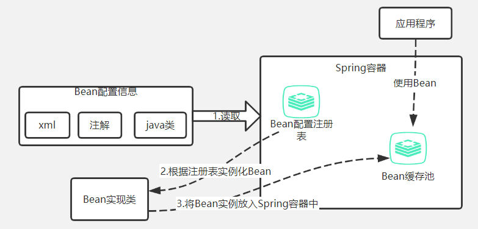
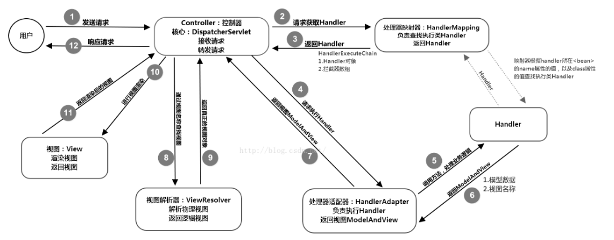

https://blog.csdn.net/a745233700/article/details/80959716

https://blog.csdn.net/a745233700/article/details/80963758

### 什么是Spring

Spring是一个轻量级的IOC和AOP容器框架，目标是简化企业应用开发

### Spring优点

- 轻量，低侵入式，代码污染极低
- Spring通过IOC实现了松耦合
- Spring支持AOP，把业务逻辑和系统服务分开
- 通过配置完成对事务的支持

### Spring容器视图

Spring启动时读取应用程序提供的Bean配置信息，并在Spring容器中生成Bean配置注册表，然后根据注册表实例化Bean，装配好Bean之间的依赖关系。



### Bean的作用范围

1. singleton：默认，容器中只有一个Bean实例
2. prototype：为每个bean请求提供一个实例
3. request：为每个网络请求提供一个实例
4. session：确保每个session中有一个实例
5. global-session：全局作用域

### Spring Bean的生命周期

**1、从xml中读取bean配置，并实例化Bean**

**2、设置对象属性**

**3、处理Aware接口**

如果Bean实现了BeanNameAware接口，那么会调用setBeanName(String beanId)，传递的是配置文件中Bean的id值

如果Bean实现了BeanFactoryAware接口，那么会调用setBeanFactory()，传递的是BeanFactory容器实例传入

如果Bean实现了ApplicationContextAware接口，那么会调用setApplicationContext()，将Bean所在应用上下文引用传入

**4、BeanPostProcessor**

如果Bean实现了BeanPostProcessor接口，那么Spring会调用postProcessBeforeInitialization()方法

**5、InitializingBean 与 init-method**

如果Bean实现了InitializingBean接口，那么会调用afterPropertiesSet()方法；如果Bean在配置文件中配置了init-method属性，那么会自动调用配置的初始化方法

**6、BeanPostProcessor**

如果Bean实现了BeanPostProcessor接口，那么会调用postProcessAfterInitialization()方法

**7、此时，Bean已经准备就绪，可以被使用了**

**8、销毁**

如果Bean实现了DisposableBean接口，那么会调用destroy()；如果在配置文件中配置了destroy-method属性，那么会调用其配置的销毁方法

### Spring依赖注入的方式

name和id都可以，最好使用id

1. 构造器注入

   ```JAVA
   package zcs.springdemo
   public class Car{
       private Wheel wheel;
       public Car(Wheel wheel){
           this.wheel=wheel;
       }
   }
   ```

   ```xml
   <bean name="car" class="zcs.springdemo.Car">
       <constructor-arg ref="wheel"></constructor-arg>
   </bean>
   <bean name="wheel" class="zcs.springdemo.Wheel"></bean>
   ```

2. set()注入

   ```java
   package zcs.springdemo
   public class Student{
       private int id;
       public void setId(int id){
           this.id=id;
       }
   }
   ```

   编写xml，name是类的别名，class是类全名，用<property>标签来指定需要设置的类属性，如果是类，value改成ref，并且添加类的bean

   ```xml
   <bean name="student" class="zcs.springdemo.Student">
   	<property name="id" value="123"></property>
   </bean>
   ```

3. 静态工厂注入
   为了让Spring管理所有对象，不能直接调用工厂类的静态方法，而是依然使用spring注入获取

   ```java
   package zcs
   public class DaoFactory{
       public static final FactoryDao getStaticFactoryDaoImpl(){
           return new StaticFactoryDaoImpl();
       }
   }
   
   public class SpringAction{
       private FactoryDao staticFactoryDao;
       public void setStaticFactoryDao(FactoryDao staticFactoryDao){
           this.staticFactoryDao=staticFactoryDao;
       }
   }
   ```

   注意xml，`staticFactoryDao`的引用指向的是静态工厂，并且配置`factory-method`指定调用哪个方法

   ```xml
   <bean name="springAction" class="zcs.SpringAction">
   	<propertory name="staticFactoryDao" ref="staticFactoryDao"></propertory>
   </bean>
   <bean name="staticFactoryDao" class="zcs.DaoFactory" factory-method="getStaticFactoryDaoImpl"></bean>
   ```

4. 实例工厂注入

   ```java
   package zcs
   public class DaoFactory{
       public FactoryDao getFactoryDaoImpl(){
           return new FactoryDaoImpl();
       }
   }
   public class SpringAction{
       private FactoryDao factoryDao;
       public void setFactoryDao(FactoryDao factoryDao){
           this.factoryDao=factoryDao;
       }
   }
   ```

   ```xml
   <bean name="springAction" class="zcs.SpringAction">
   	<propertory name="factoryDao" ref="factoryDao"></propertory>
   </bean>
   <!--工厂类实例bean-->
   <bean name="daoFactory" class="zcs.DaoFactory"></bean>
   <!--从工厂类bean中获取实例方法-->
   <bean name="factoryDao" factory-bean="daoFactory" factory-method="getFactoryDaoImpl"></bean>
   
   ```

### Spring自动装配

一共四种

```java
public interface AutowireCapableBeanFactory extends BeanFactory {
    int AUTOWIRE_NO = 0;
    int AUTOWIRE_BY_NAME = 1;
    int AUTOWIRE_BY_TYPE = 2;
    int AUTOWIRE_CONSTRUCTOR = 3;
    /** @deprecated */
    @Deprecated
    int AUTOWIRE_AUTODETECT = 4;
}
```

```java
public class User{
    private Role myRole;
}
public class Role {
    private String id;  
    private String name;
}
```

**1、no**

默认是不自动装配

**2、byName**

把与Bean的属性具有相同名字的其他Bean自动装配到该Bean的对应属性中

```xml
<bean id="myRole" class="com.entity.Role">
    <property name="id" value="1001"></property>
    <property name="name" value="管理员"></property>
</bean>

<bean id="user" class="com.entity.User" autowire="byName"></bean>
```

如果能够找到user的属性myRole名称对应的Bean，就会自动装配

**3、byType**

和ByName类似，ByType是把与Bean的属性具有相同类型的其他Bean自动装配到该Bean对应的属性中

```xml
<bean class="com.entity.Role">
    <property name="id" value="1001"></property>
    <property name="name" value="管理员"></property>
</bean>

<bean id="user" class="com.entity.User" autowire="byType"></bean>
```

属性对应的Bean的id也可以省略了

如果有多个Bean符合要求，会抛出异常

**4、constructor**

把与Bean的构造器入参具有相同**类型**的其他Bean自动装配到对应的入参中

```java
public class User{
    private Role role;

    public User(Role role) {
        this.role = role;
    }
}
```

```xml
<bean id="user" class="com.entity.User" autowire="constructor"></bean>
```

**@Autowired**

默认是按照类型即byType自动装配，如果有多个实例，按照byName来确定Bean；如果结果为空，会抛出异常，可以加`required=false`解决

**@Resource**

按照name装配，找不到的话按type装配

### @Autowired原理


### 事务

7个传播属性：

- Propagation.REQUIRED：默认，如果当前有事务则加入，没有则新建
- Propagation.REQUIRES_NEW：如果当前有事务则挂起当前事务，然后新建；没有则新建
- Propagation.SUPPORTS ：如果当前有事务则加入，没有则不用事务
- Propagation.NOT_SUPPORTED：以非事务方式执行
- Propagation.MANDATORY：如果当前没有事务则抛出异常
- Propagation.NEVER：以非事务方式执行，如果当前有事务则抛出异常
- Propagation.NESTED：如果当前有事务，则嵌套在当前事务中；没有则新建。新增保存点作为回滚点，外层事务失败时会回滚内层事务，内层事务失败时不会回滚外层事务

编程式事务管理：这意味你通过编程的方式管理事务，给你带来极大的灵活性，但是难维护。

声明式事务管理：这意味着你可以将业务代码和事务管理分离，你只需用注解和XML配置来管理事务。

### Aop实现接口限流

定义一个注解

```java
@Target(ElementType.METHOD)
@Retention(RetentionPolicy.RUNTIME)
public @interface ServiceLimit {
}
```

定义aop

```java
import com.google.common.util.concurrent.RateLimiter;
import org.aspectj.lang.ProceedingJoinPoint;
import org.aspectj.lang.annotation.Around;
import org.aspectj.lang.annotation.Aspect;
import org.springframework.stereotype.Component;

@Component
@Aspect
@SuppressWarnings("UnstableApiUsage")
public class RateLimiterAop {
    private final RateLimiter rateLimiter = RateLimiter.create(1);

    @Around("@annotation(zcs.user_center.controller.ServiceLimit)")
    public Object around(ProceedingJoinPoint joinPoint) {
        boolean flag = rateLimiter.tryAcquire();
        Object obj = null;
        try {
            if (flag)
                obj = joinPoint.proceed();
        } catch (Throwable e) {
            e.printStackTrace();
        }
        return obj;
    }
}
```

api中使用注解

```java
@RestController
public class OrderController {
    @ServiceLimit
    @GetMapping("/order")
    public String order(){
        return "11";
    }
}
```

### 设计模式

1. 工厂模式：BeanFactory是简单工厂模式
2. 单例模式：Bean默认是单例
3. 代理模式：AOP使用了java的动态代理和CGLIB字节码生成技术
4. 模板方法：解决代码重复的问题，如RestTemplalte
5. 观察者模式：定义对象键一对多的依赖关系，当一个对象的状态发生改变时，所有依赖于它的对象都会得到通知被更新，如ApplicationListener

### 三级缓存

https://www.jianshu.com/p/6c359768b1dc

https://blog.csdn.net/f641385712/article/details/92801300

Bean的初始化分为三步：实例化、填充属性、初始化。循环依赖主要发生在前两步

```java
/** Cache of singleton objects: bean name --> bean instance 缓存单例实例化对象的Map集合*/
private final Map<String, Object> singletonObjects = new ConcurrentHashMap<String, Object>(256);

/** Cache of early singleton objects: bean name --> bean instance */
private final Map<String, Object> earlySingletonObjects = new HashMap<String, Object>(16);

/** Cache of singleton factories: bean name --> ObjectFactory */
private final Map<String, ObjectFactory<?>> singletonFactories = new HashMap<String, ObjectFactory<?>>(16);

// 这个缓存也十分重要：它表示bean创建过程中都会在里面呆着~
// 它在Bean开始创建时放值，创建完成时会将其移出~
private final Set<String> singletonsCurrentlyInCreation = Collections.newSetFromMap(new ConcurrentHashMap<>(16));
```

创建Bean的时候，Spring首先会尝试从缓存中获取

```java
//interface SingletonBeanRegistry的一个方法
protected Object getSingleton(String beanName, boolean allowEarlyReference) {
   Object singletonObject = this.singletonObjects.get(beanName);
   if (singletonObject == null && isSingletonCurrentlyInCreation(beanName)) {
      synchronized (this.singletonObjects) {
         singletonObject = this.earlySingletonObjects.get(beanName);
         if (singletonObject == null && allowEarlyReference) {
            ObjectFactory<?> singletonFactory = this.singletonFactories.get(beanName);
            if (singletonFactory != null) {
               singletonObject = singletonFactory.getObject();
               this.earlySingletonObjects.put(beanName, singletonObject);
               this.singletonFactories.remove(beanName);
            }
         }
      }
   }
   return (singletonObject != NULL_OBJECT ? singletonObject : null);}
```

首先解释两个参数：

- isSingletonCurrentlyInCreation 判断对应的单例对象是否在创建中，当单例对象没有被初始化完全(例如A定义的构造函数依赖了B对象，得先去创建B对象，或者在populatebean过程中依赖了B对象，得先去创建B对象，此时A处于创建中)
- allowEarlyReference 是否允许从singletonFactories中通过getObject拿到对象

分析getSingleton的整个过程：Spring首先从singletonObjects中尝试获取，如果为空并且对象正在创建中，则尝试从earlySingletonObjects中获取，如果还是获取不到并且允许从singletonFactories通过getObject获取，则通过singletonFactory.getObject()获取。如果获取到了就将三级缓存提升到二级缓存

```java
this.earlySingletonObjects.put(beanName, singletonObject);
this.singletonFactories.remove(beanName);
```

向二级缓存添加数据只能从三级缓存移动

#### 源码流程


1. 入口为AbstractBeanFactory的getBean()，调用了doGetBean方法

   ```java
   public Object getBean(String name) throws BeansException {
      return doGetBean(name, null, null, false);
   }
   protected <T> T doGetBean(...){
   	... 
   	// 标记beanName a是已经创建过至少一次的~~~ 它会一直存留在缓存里不会被移除（除非抛出了异常）
   	// 参见缓存Set<String> alreadyCreated = Collections.newSetFromMap(new ConcurrentHashMap<>(256))
   	if (!typeCheckOnly) {
   		markBeanAsCreated(beanName);
   	}
   	//第2步
   	// 此时a不存在任何一级缓存中，且不是在创建中  所以此处返回null
   	// 此处若不为null，然后从缓存里拿就可以了(主要处理FactoryBean和BeanFactory情况吧)
   	Object beanInstance = getSingleton(beanName, false);
   	...
   	// 这个getSingleton方法非常关键。
   	//1、标注a正在创建中~
   	//2、调用singletonObject = singletonFactory.getObject();（实际上调用的是createBean()方法）  因此这一步最为关键
   	//3、此时实例已经创建完成  会把a移除整整创建的缓存中
   	//4、执行addSingleton()添加进去。（备注：注册bean的接口方法为registerSingleton，它依赖于addSingleton方法）
   	//第3步
        sharedInstance = getSingleton(beanName, () -> { ... return createBean(beanName, mbd, args); });
   }
   
   ```

2. 注意和3的区别，这里是上文讲到的获取缓存的getSingletion

3. 这个getSingletion第二个参数是ObjectFactory，执行了该参数的getObject方法，也就是createBean

   ```java
   getSingleton(beanName, () -> {
      try {
         return createBean(beanName, mbd, args);
      }
   }
   getSingleton(String beanName, ObjectFactory<?> singletonFactory){
       singletonObject = singletonFactory.getObject();
   ```
   }
   
4. AbstractAutowireCapableBeanFactory的createBean()调用了doCreateBean()

5. doCreateBean()是核心

6. createBeanInstance()创建实例

7. 把bean注册到三级缓存，之后调用三级缓存的时候会运行后置处理器的getEarlyBeanReference，创建代理对象

   ```java
   addSingletonFactory(beanName, () -> getEarlyBeanReference(beanName, mbd, bean));
   ```

8. 填充属性

9. 调用后置处理器的两个方法      

## SpringMVC

### 概念

基于Java实现MVC设计模式的轻量级Web框架，通过分离Model、View和Controller，将Web层进行职责解耦，简化开发

### SpringMVC流程

1. 浏览器发送请求至前端控制器DispatcherServlet
2. DispatcherServlet收到请求后，调用处理器映射器HandlerMapping根据url查找具体的处理器Handler，生成处理器对象和处理器拦截器返回给DispatcherServlet
3. 调用处理器适配器HandlerAdapter执行具体的处理器，得到结果ModelAndView
4. DispatcherServlet将结果传给视图解析器ViewResolver进行解析，返回具体的view
5. DispatcherServlet将view进行渲染，返回给浏览器




## SpringBoot

### 优点

以jar包形式独立运行；内嵌Tomcat；使用JavaConfig来减少xml配置；提供了一系列的starter来简化Maven依赖

## SpringCloud

### 服务注册与发现

1. 服务启动时，将信息注册到server端注册表，每隔30s向server端发送心跳，如果超过90s没有收到，那么将服务剔除
2. server端立即将注册表同步到readwrite缓存，并且每隔30s将readwrite缓存同步到readonly缓存
3. 当注册表发送变动时，server端会先清除readwrite缓存，过了eureka.server.response-cache-update-interval-ms参数设置的时间后（默认是0）清除readonly缓存
4. 当有服务拉取信息的时候，顺序是readonly缓存--readwrite缓存--注册表


