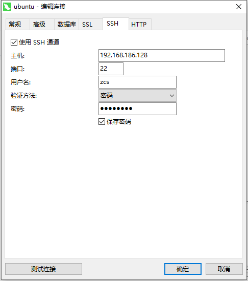
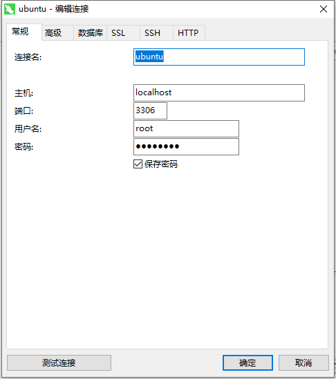
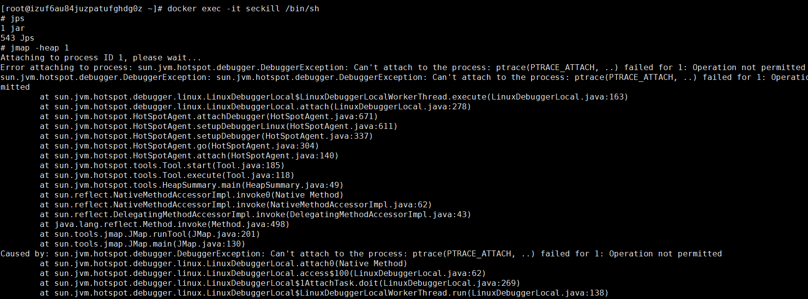

## Docker

```yml
#启动并设置docker为守护线程
systemctl daemon-reload && systemctl start docker
#查看版本
docker version 

docker-compose stop
docker-compose up -d --build
docker-compose -f E:\JAVA\cloudOne\docker-compose-server.yml up -d config-server
```

## 镜像

```python
#查看镜像
docker images 
#删除镜像
docker rmi ID
#修改镜像名
docker tag oldName newName 
#删除none镜像
docker rmi $(docker images | grep "none" | awk '{print $3}')
```

[Docker](https://www.jianshu.com/nb/27175014)

## 容器

docker run -itd --name mysql -p 3306:3306 mysql /bin/bash

- **-i**：交互式操作
- **-t**：终端
- **-d**：后台运行 
- **/bin/bash**：放在镜像名后的是命令，这里我们希望有个交互式 Shell，因此用的是 /bin/bash
- **--name**：容器名称
- **-p 8080:80**：端口映射，将本地8080映射到容器内部80

### 命令

docker ps <-a> 查看正在运行/所有容器

docker container rm ID 删除

docker start ID启动

docker stop ID 停止

docker exec -it ID /bin/bash 进入容器

docker exec -it ID ip addr 查看容器ip

docker run -d --name eureka-server --expose=8762 -p 8762:8762 -e "server.port=8762" eureka-server-single:latest

## Navicat连接mysql

先在虚拟机的mysql中操作

```mysql
mysql> use mysql; 
mysql> create user 'root'@'%' identified by '123456';
mysql> grant all privileges on *.* to 'root'@'%' with grant option;
mysql> ALTER USER 'root'@'%' IDENTIFIED WITH mysql_native_password BY '123456';
mysql> flush privileges;
```

#### 使用SSH通道

主机：ubuntu的ip

用户名和密码：ubuntu的



主机：localhost

用户名和密码：ubuntu中mysql的



## 常见问题

#### 无法使用JVM相关命令

以seckill模块为例

```yml
docker exec -it seckill /bin/sh
#获取pid
jps
jmap -heap 1
```

这个时候会报<font color='red'>Can't attach to the process: ptrace(PTRACE_ATTACH, ..) failed for 1: Operation not permitted</font>



三种解决方法：https://blog.csdn.net/russle/article/details/99708261

1. 创建容器的时候指定参数

   ```xml
   docker run --cap-add=SYS_PTRACE ```
   ```

2. 修改docker compose

   ```yml
   version: '3'
   services:
     seckill:
       image: seckill
       ports:
       - "8650:8650"
       container_name: "seckill"
       cap_add:
         - SYS_PTRACE
   ```

3. 直接关闭 seccomp 配置或者将ptrace添加到允许的名单中

   ```xml
   docker run --security-opt seccomp:unconfined ...
   ```


