## 为什么快

- 单进程单线程
- 基于内存
- 多路复用I/O

## 线程模型

基于Reactor实现的文件事件处理器，是单线程的，采用多路复用IO机制同时监听多个socket

## 数据类型

- String：key-value结构，一个键最大能存储512MB。微博数、粉丝数。
- list：双向链表。微博关注列表、粉丝列表、消息列表。
- hash：适合存储对象。存储用户信息。
- set：无序集合，集合成员是唯一的。共同关注、共同粉丝。
- zset：有序集合，比set多了权重参数score。

## 编码

```sql
object encoding key
```

| 数据类型 | 编码                |
| -------- | ------------------- |
| String   | int、embstr、raw    |
| list     | ziplist、linkedlist |
| hash     | ziplist、字典       |
| set      | intset、字典        |
| zset     | ziplist、skiplist   |

- String：
  - int：整数值并且可以用long表示。当执行一些命令(append)使得这个值不再是整数值的时候会变为raw
  - embstr：长度小于等于32字节，一次内存分配。只读类型，修改时会转换为raw
  - raw：其他，两次内存分配
- list：当所有字符串元素的长度小于64字节、数量小于512时使用ziplist

## 数据结构

### SDS

shshdr结构表示SDS值

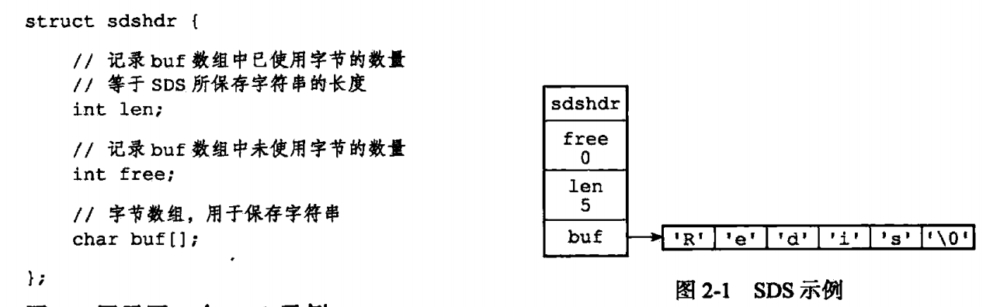

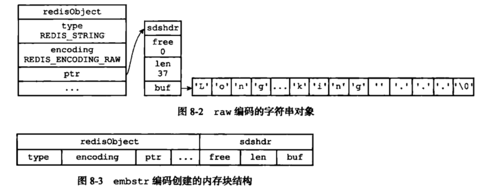

redis使用SDS来代替C语言中的字符串，优点：

- 常数复杂度获取字符串长度
- 当SDS需要修改时，会先检查空间是否足够，防止缓冲区溢出
- 通过空间预分配和惰性空间释放来减少修改字符串带来的内存重分配次数
  - 空间预分配：当修改SDS并且需要空间扩展时，程序会分配额外的未使用空间。如果SDS修改之后，长度小于1MB，那么分配和len属性一样的free空间，实际长度为len+free+1byte(free=len，1为空字符)，否则分配1MB的free空间，实际长度为len+1MB+1byte
  - 惰性空间释放：当SDS需要缩短时，不立即进行内存重分配来回收多余的字节，而是使用free属性记录
- 二进制安全：c字符串通过空字符判断结束，会有问题

### 链表

### 压缩列表

将数据按照一定规则编码在一块连续的内存区域，以节省内存。

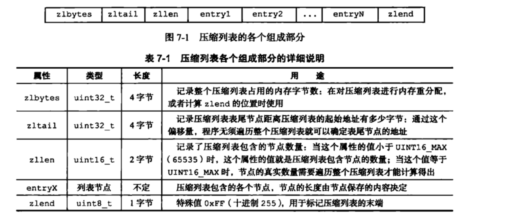

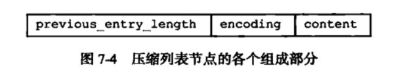

- previous_entry_ength：前一个节点的长度，1个或5个字节。如果前一个节点的长度小于254，则为1个字节，存储的就是长度；如果大于等于254，则第一个字节的值为254，后四个字节表示长度
- encoding：表示content的内容类型和长度
- content：保存节点的内容

### 字典

Redis的数据库、hash键都是使用字典实现

字典使用hash表实现，由dict.h/dictht结构表示；

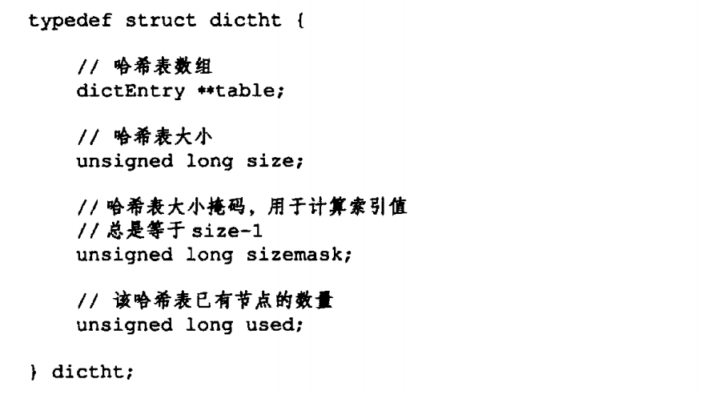

dictEntry：hash表节点，保存键值对

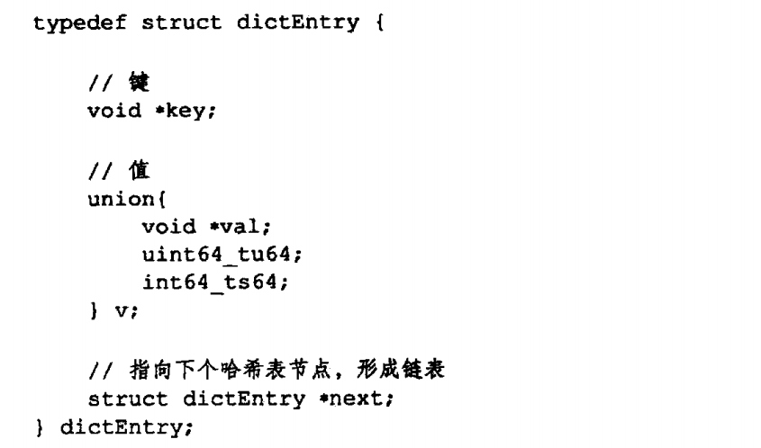

字典由dict.h/dict结构表示，其中包含了两个hash表和rehashidx变量。一般情况下字典只使用ht[0]哈希表，ht[1]只会在对ht[0]进行rehash时使用

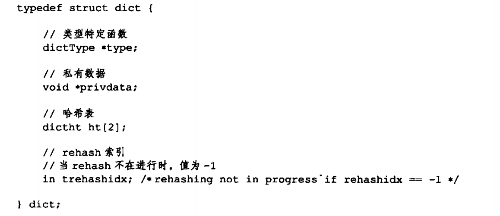

#### rehash

1. 扩展：将ht[1]的大小设为第一个大于等于`ht[0].used*2`的2^n^，
   收缩：将ht[1]的大小设为第一个大于等于`ht[0].used`的2^n^，
2. 将ht[0]的键值rehash到ht[1]
3. 释放ht[0]，将ht[1]设为ht[0]，然后为ht[1]分配一个空白哈希表

#### 扩展与收缩

- 服务器没有执行BGSAVE或BGREWRITEAOF命令，且负载因子>=1，执行扩展
- 服务器在执行BGSAVE或BGREWRITEAOF命令，且负载因子>=5，执行扩展
- 负载因子<=0.1时，执行收缩

#### 渐进式rehash

如果哈希表键值对数量过多，一次性hash的话会导致服务器无响应，所以采用渐进式rehash

1. 为ht[1]分配空间，让字典同时持有ht[0]和ht[1]
2. 将rehashidx设为0，表示rehash开始
3. 在rehash进行期间，每次对字典执行CRUD操作时，服务器会顺带将ht[0]在rehashidx上的所有键值对rehash到 ht[1]，然后将rehashidx加1
4. 完成之后将rehashidx设为-1

### 跳跃表

平均时间复杂度 O(logN)，最坏O(N)，是zset的底层实现之一

zskiplist结构保存相关信息，下图最左边的

- header：指向头节点，头节点是个什么都不存储的dummy节点，层数为32
- tail：指向尾结点
- level：最大层数
- length：长度

zskiplistNode结构表示跳跃表节点

- 层：每个层包括前进指针和跨度。前进指针指向下一个同层节点，跨度表示下一个节点和当前节点的距离，用来查询排名
- BW：后退指针
- score：分值，可以相同
- obj：成员对象，指向一个字符串对象，字符串对象保存着一个SDS值，必须唯一。当score相同时，按照成员对象在字典序中的大小来排名

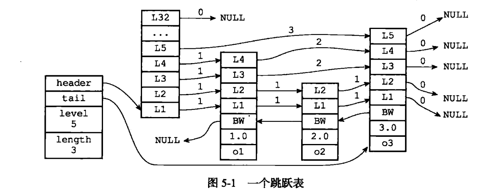

### zset实现

zset对象编码由ziplist和skiplist组成。当元素数量小于128并且所有member的长度都小于64字节时使用ziplist，其余情况使用skiplist+字典

skiplist的每个节点会随机一个层数。比如是3，那么就把它放入1-3层这三层链表中。字典存储了member-score的映射关系

### 对象


## 过期键删除策略

```yml
# 生存时间 秒/毫秒
expire/pexpire key seconds
# 过期时间 是unix时间戳
expireat/pexpireat key unix_time
# 显示剩余生存时间
ttl/pttl key

expire、pexpire、pexpireat
```

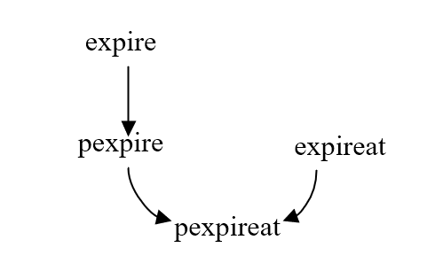

- 惰性删除：每次取键时检查，如果过期则删除。节省CPU资源，占用大量内存
- 定时删除：在设置键的过期时间的同时设置一个定时器，在键的过期时间到来时进行删除
- 定期删除：redis会将设置过期时间的key放到一个字典中，默认100ms随机抽取一些key，如果过期就删除。具体：从字典随机20个key，删除过期的key，如果比例超过1/4，则重复

Redis采用定期删除+惰性删除

## 淘汰策略

volatile-lru：从已设置过期的数据集中挑选最久未使用的淘汰

volatile-ttl：从已设置过期的数据集中挑选将要过期的数据淘汰

volatile-random：从已设置过期的数据集中任意挑选数据淘汰

allkeys-lru：从数据集中挑选最久未使用的数据淘汰

allkeys-random：从数据集中任意挑选数据淘汰

noeviction：禁止淘汰数据

## 数据库底层实现

```c++
struct redisServer {
    // 一个数组，保存着服务器中的所有数据库
    redisDb *db;
    // 数据库数量
    int dbnum;
};
typedef struct redisDb {
    // 数据库键空间，保存着数据库中所有键值对
    dict *dict;
    / ...
    // 过期字典，保存着键的过期时间
    dict *expires;
} redisDb;
```

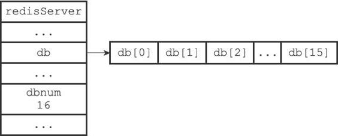


## LRU

### HashMap和双向链表实现

HashMap的Key存储key，Value指向Node节点，保证save和get key的时间都是O(1)

首先预设LRU容量，如果满了，淘汰掉尾节点；每次新增和访问数据，把节点新增或移动到头部

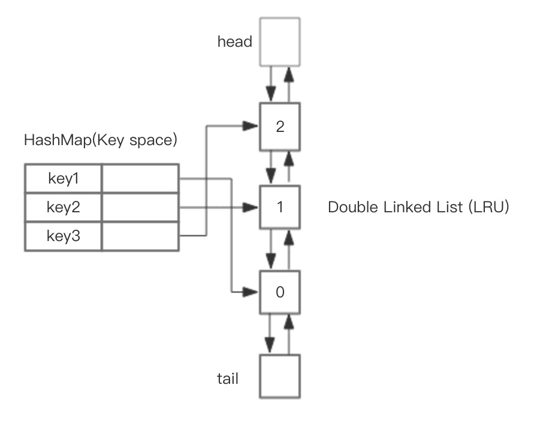

### Redis中LRU实现

上述实现需要额外空间存放双向链表中的next和pre指针，所以redis采用近似LRU算法

1. redis有一个全局时钟`lruclock`
2. 每个object有一个24bit的字段，用来记录最后一次操作的时间戳，在初始化和操作的时候会得到全局`lruclock`来更新自己的`lruclock`。
3. 如果设置了`maxmemory`，每次操作都要判断是否需要淘汰。随机选择5个(maxmemory-samples值)key，根据全局时钟和key 的内部时钟的差值由小到大排序，放入到**淘汰池**中，释放掉最后一个key

## 持久化

### RDB(默认)

按照一定的时间间隔生成数据集的时间点快照，实际操作过程是fork一个子进程，先将数据集写入临时文件，写入成功后，再替换之前的文件，用二进制压缩存储。

优点：

1. 整个Redis数据库只有一个文件，非常适合用于备份和灾难恢复
2. 性能最大化。Redis服务在开始持久化时，只需要fork出一个子进程，然后子进程会处理持久化工作，父进程无需执行任何磁盘IO操作
4. 在恢复大数据集时比AOF快

缺点：

1. 在需要保证数据的高可用性，即尽量避免服务器故障时丢失数据的场合不适用。因为在定时持久化之前的数据都不能保存
2. Redis要fork出一个子进完成持久化，如果数据集过大，会阻塞服务器，写入磁盘的时候会影响性能

### AOF

将所有的命令行以 Redis 协议的格式来保存，新命令会被追加到文件的末尾。在服务器启动时，通过重新执行这些命令来还原数据集

优点：

1. 更高的数据安全性，即数据持久性。Redis提供了三种同步策略：每秒同步、每修改同步和不同步。默认是每秒同步，也是异步完成，效率非常高。
2. 通过追加模式写入文件，出现宕机也不会破坏日志已经存在的内容。如果写入了不完整的数据，`redis-check-aof` 工具也可以修复这种问题。
3. 如果文件过大，Redis会自动在后台启动**rewrite**机制，产生一个更小的AOF文件：在执行bgrewriteaof命令时，redis服务器会维护一个AOF重写缓冲区，该缓冲区会在子进程创建新文件期间，记录服务器执行的所有写命令。当子进程创建完新文件后，服务器会将缓冲区的内容追加到新文件末尾，然后替换旧文件

缺点：

1. AOF文件通常大于RDB文件，且恢复大数据集时的速度慢
2. 根据同步策略的不同，AOF在运行效率上往往会慢于RDB。每秒同步策略的效率是比较高的，**同步禁用**策略的效率和RDB一样高效。

## 事务

- 如果队列中存在语法性错误，则正确命令会被执行，错误命令抛出异常，不会回滚
- 如果队列中存在命令性错误，则所有命令都不执行

## 分布式锁

### setnx

以前经常看到使用setnx+expire命令加锁，del解锁，但是在加锁和解锁时都是有问题的：

- 加锁时：这两个命令是非原子性的，如果执行完setnx后redis宕机，那么锁就永远无法释放。
- 解锁时：直接使用del的话会导致任何客户端都可以解锁

通常有两种方法

```lua
-- 加锁：set key value ex sec(秒) px mill(毫秒) nx
1、set name unique_value px 3000 nx

-- 通常使用Lua脚本来实现
2、if redis.call('setnx',KEYS[1],ARGV[1]) == 1 then
   	redis.call('expire',KEYS[1],ARGV[2])
    return 1
else
    return 0
end

--解锁：通过UUID生成唯一值，解锁时判断是不是同一个值
if redis.call('get',KEYS[1]) == ARGV[1] then
   return redis.call('del',KEYS[1])
else
    return 0
end
```

### RedLock

使用多个Redis实例来实现分布式锁，保证高可用

1. 获取当前时间戳
2. 从N个实例中获取锁
3. 计算获取锁后的时间减去第一步的时间，如果差小于锁过期时间并且有一半以上的实例，则获取锁成功
4. 成功后，锁的真正有效时间是锁过期时间减去第三步的时间差
5. 如果失败，则开始解锁

### Zookeeper

- 创建一个目录/lock
- 客户端获取锁时，在/lock下创建临时的有序子节点
- 获取/lock下的子节点列表，判断自己创建的是否为列表中最小的子节点，如果是则获得锁，否则监听前一个节点，得到通知后重复此步骤直到获取锁
- 业务完成后，删除对应的子节点

## 问题

### 热key

某一热点key的请求量特别大，超过服务器性能极限

解决：

- 本地缓存，缺点是过期时间问题
- 热key加上后缀（随机数），将一个热key变为多个key分布到不同的主机上

### big key

数据大小远大于其他key，造成内存不足

解决：
拆分，比如对json通过mset进行分散

### 缓存击穿

某个热点缓存过期，大量请求这个key导致数据库崩溃

**解决**

使用互斥锁

### 缓存雪崩

1. redis挂掉了
2. 大量缓存失效，新缓存未到，导致原本需要访问缓存的请求都去查询数据库了，数据库压力过大，严重的话会宕机，最后造成整个系统崩溃

**解决**

1. 实现redis的高可用；通过持久化机制保存的数据快速恢复缓存
2. 避免缓存在同一时间过期

### 缓存穿透

查询一个一定不存在的数据，缓存层不命中，又去查询存储层，也不命中。如果有大量这样的请求，会对存储层造成较大压力

**解决**

1. 参数校验
2. 缓存空对象：需要大量的缓存空间，可以设置一个较短的过期时间；数据不一致，可以利用消息系统删除
3. 布隆过滤器：本质是一个bit向量，通过多个Hash函数将值映射到不同的bit中。查询时将值进行同样Hash，如果存在bit为0，那么一定不存在该值，如果都是1，则可能存在

## 架构

### 主从复制

主服务器将数据同步给从服务器，降低主服务器的读压力。slave启动时会发送PSYNC命令给master，如果是第一次连接会触发全量复制。master生成RDB快照，并缓存新的写请求。slave收到快照后写进本地磁盘并加载进内存，然后master将缓存发送给slave

无法保证高可用，没有解决主服务器的写压力。

### 哨兵

监控主从数据库；master出现异常时进行故障迁移；多哨兵之间互相监控

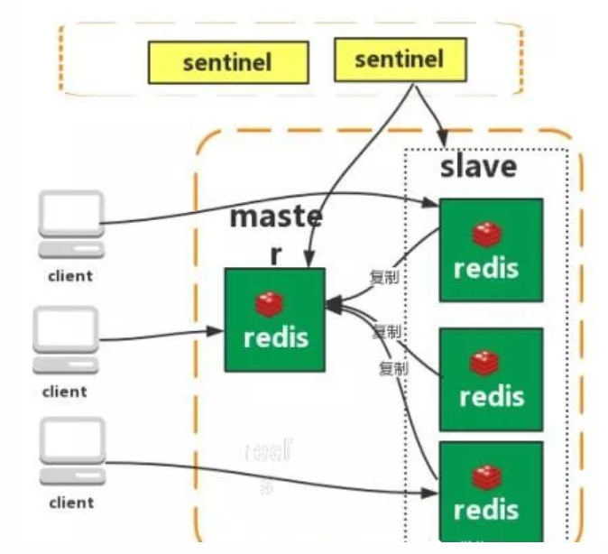

哨兵启动后，会与要监控的master建立两条连接：
1、订阅master的\_sentinel_:hello频道用于获取其他监控该master的哨兵节点信息
2、定期向master发送INFO等命令获取master信息

建立连接后，哨兵会执行三个操作：
1、定期向master和slave发送INFO命令，用于新节点的自动发现
2、定期向master和slave的\_sentinel_:hello频道发送自己的信息
3、定期向master、slave和其他哨兵发送ping命令，如果没有回复则进行**主观下线**处理。如果主观下线的是主节点，会咨询其他哨兵节点，如果超过半数，则进行**客观下线**处理

哨兵认为master客观下线时，通过Raft算法选举出领头哨兵进行故障恢复：
1、发现master下线的哨兵节点(A)向每个哨兵发送命令，要求对方选自己为领头
2、如果其他哨兵节点没有选过其他节点，则同意
3、如果超过一半同意，则A当选
4、如果有多个哨兵节点参选，则有可能无法选出，此时参选的节点等待一个随机时间后再次发起参选请求，直至选出

选出领头哨兵后，开始故障恢复：
1、选择所有在线的slave中优先级最高的
2、如有多个，则选择复制偏移量最大的(即复制越完整)
3、否则选取id最小的

为了避免单个哨兵出问题，一般采用哨兵集群。

优缺点：保证高可用，监控各个节点，自动故障迁移，但是没有解决主服务器写的压力

### 集群

Redis Cluter 实现了完全去中心化、线性扩展的集群方案。集群由多个节点组成，数据分布在节点中。节点分为主节点和从节点。提出哈希槽概念，包含16384个哈希槽，使用CRC16(key)%16384来计算key属于哪个槽

## 常用命令

```yml
object encoding|refcount|idletime

set key val

get key

del key

exists key

hset key field value

hget key field

```


